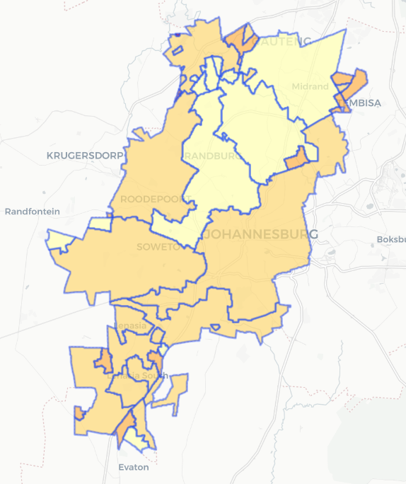
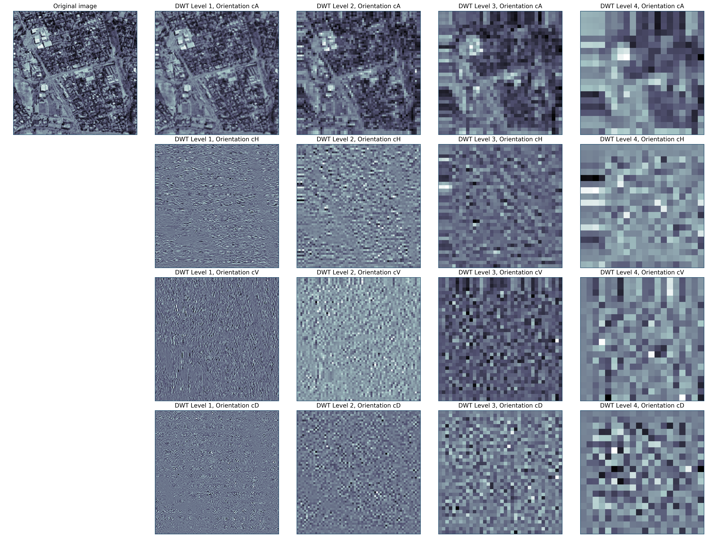
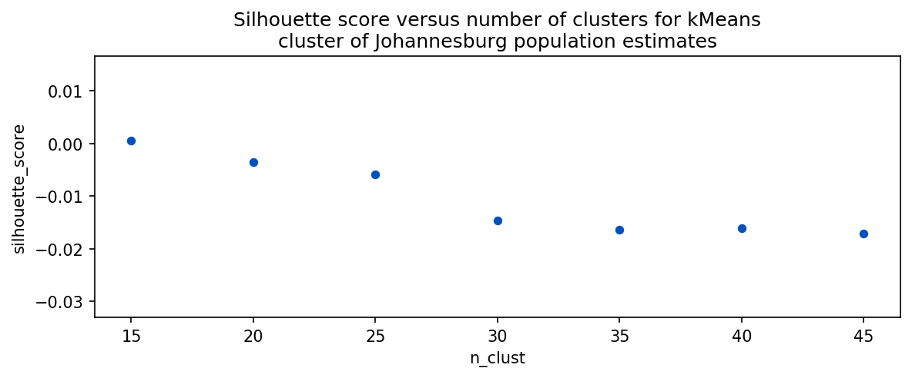
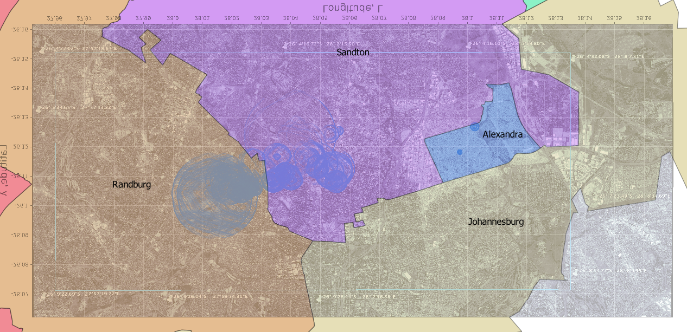

 

# Improve Slum Area Identification through Real-Estate Data (problem 18)

#### File Directory:
- Assets (Contains shapefiles R scripts used to create final map.)
- Code (Contains code used to scrape government website + clustering algorithm.)
- Data (Raw data from scrape and population density data.)
- Graphics (Geotiffs and images used in ReadMe + Power Point)
	- ReadMe.md (ReadMe)
	- city_final.html (Final Leaflet Interactive Map of City of Johannesburg Metropolitan Municipality)
	- .gitignore (Gitnore)

## Friday, February 21, 2020.
https://git.generalassemb.ly/DSI-US-10/project-client-project

## Team members:

|[Michael Ono](https://www.linkedin.com/in/michael-ono/)|[Dylan Blough](https://www.linkedin.com/in/dylan-blough-b2185619a/)|[Neil Hamlett](https://www.linkedin.com/in/neil-hamlett-strategic-quant/)|
|---|---|---|

## Problem Statement. 

Mapping of ***informal settlements*** with satellite imagery is a long-standing practice, but such methods could be enhanced through web-scraped real-estate data. This project would build a web scraper to house and apartment adverts for a selected city in Africa/Latin America/Middle East. The scraper should download all adverts in the city during a recent period (ideally 3 years or more); and map all the adverts. The project should test the feasibility of estimating informal tenure from this information. Using gridded population estimates (e.g. from Facebook), the team would calculate the ratio of real estate adverts with population density. This ratio could serve as an input to machine learning models aimed at mapping informal settlements.

The team selected Johannesburg, SA for purposes of prototyping.  Johannesburg meets multiple criteria.  It is a major population center in a developing economy. This is a client criterion.  For data-availability purposes, SA is the most-developed economy on the Africa continent. 

## Elaboration.

***Informal settlements*** (*aka* "slums") can be defined as " highly populated urban residential area consisting mostly of closely packed, decrepit housing units in a situation of deteriorated or incomplete infrastructure, inhabited primarily by impoverished persons" [Wikipedia](https://en.wikipedia.org/wiki/Slum).  For our purposes *informal settlements* are urban residential concentrations that are not supported by public services.  Beyond infrastructure services, these also include legal status, such as property deeds.

We seek here to identify local concentrations that are not reflected in official or commercial records. Applying a *data-science* approach, we attempt to compare unofficial measurements of local population densities with official or commercial sources. Our "slums" will be localities in which high concentrations of residents are indicated that do not coincide with "official" sources.

Some "ground truth" is available.  A Wikipedia article [*List of slums in South Africa*](https://en.wikipedia.org/wiki/List_of_slums_in_South_Africa) specifically identifies [Alexandra, Gauteng](https://en.wikipedia.org/wiki/Alexandra,_Gauteng) in [Johannesburg](https://en.wikipedia.org/wiki/Johannesburg), our target region.  This area is visually distinct in overhead imagery we use in our analysis.

## Technical Approach.

We apply the [Cross-Industry Standard Process – Data Mining](http://4.bp.blogspot.com/-0iGdZDGnLks/VDA-7DKV_NI/AAAAAAAAAEI/IqYBNniTlZA/s1600/141004%2BFormal%2BMethods%2BComparison.png) (CRISP–DM).  Figure 1 provides an overview.  This method has provided the foundations for delivery methods used by many leading technology firms, including IBM.  

CRISP–DM contains more-direct coupling to the business context than some more data-centric methods.  It also provides more-explicit guidance on iterativity, an inescapable part of modeling.  The following subsections summarize its employment in this project.

#### ***Figure 1*** — Comparison of CRISP–DM method with other data and analytics methods (From [[Hamlett, 2014]](http://quantsprism.blogspot.com/2014/10/getting-value-from-business-analytics.html)).

	 

## Data Understanding, Preparation.

Figure 2 depicts the information architecture for our study.  We fundamentally approach this as a [geospatial-information science (GIS)](https://www.careerexplorer.com/careers/geospatial-information-scientist/) problem. We seek to compare official geospatial population distributions with those obtained from other means.

Our analysis involves fusion of three sources of information.  These are:

⓵ An underlying geopsatial reference frame;

⓶ "Official" population-distribution information; and 

⓷ "Alternative" population-distribution information.

### Geospatial reference frame.

We derive our geospatial reference frame from geo-referenced 

#### Figure 2 — Conceptual information architecture for study.

 

Two types of information sources interest us.  Our basic problem leads us to primarily consider geospatial information sources (GIS). Several sources exist [[EOS, April 19, 2019]](https://eos.com/blog/7-top-free-satellite-imagery-sources-in-2019/) for high-resolution overhead imagery.  Given the proof-of-concept nature of the present study, [Google Earth](https://www.google.com/earth/) is employed.

Overhead imagery downloaded from Google Earth is not geo-referenced.  That is, each pixel is not associated with a distinct longitude (𝘓) and latitude (λ). We employ here a [simple procedure](https://www.youtube.com/watch?v=pVgDyh_YBcI) described in the [*Geo-Spatial Tutorials*](https://www.youtube.com/channel/UCK-8Ky7ZiohkOrHpe6EM1Lw/about) youtube channel.  

This procedure involves adding a limited number of geo-refernced labels to a Google-Earth image. We then use the open-source [QGIS](https://www.qgis.org/en/site/) tool to attribute (𝘓, λ) associations to our labels.  This produces a [GeoTiff](https://earthdata.nasa.gov/esdis/eso/standards-and-references/geotiff) image with an estimated pixel resolution in the range of five to ten meters. Other sources provide resolution as high as one meter.  Our order-of-half-meter resolution suffices for this proof of concept. 

Figure 3 shows Google-Earth image prior to geo-referencing in QGIS.  The yellow-colored thumbtacks  are labeled (𝘓, λ) associations for each point.  We use QGIS' [Georeferencer](https://docs.qgis.org/2.18/en/docs/training_manual/forestry/map_georeferencing.html) plug in to develop an affine transform between pixels and (𝘓, λ) positions on the Earth's surface.
  

#### Figure 3 — Geo-reference-tagged overhead-image download from Google Earth.

 

### *Official* population-distribution data.

South Africa (SA) last conducted a census in 2011 [[stats sa]](http://www.statssa.gov.za).  A *Community-Survey* update was performed in 2016.  Census data is the "most-official" source of information.  It is however most-likely tied to officially-registered residencies. 

SA census data provides population summaries at the administrative subdivision level.  These data represent an SA's attempt to provide an exhaustive measurement of its inhabitants. For our purposes, this source suffers from two shortcomings.  First, it is collected relatively infrequently.  Exhaustive censuses are resource-intensive activities.

Second, the census data records population at a relatively low resolution. We end up with discrete distributions.  We assume constant distribution throughout all area within the boundaries of the administrative subdivision.  

Consequently we cannot perform statistical analysis that is possible with more-granular data. We must treat the population-distribution data within these administrative subdivisions as opaque clusters.  Fortunately, well-established methods exist for comparison with cluster information derived from other sources.  [[Weiss, *et al*, 2010, §5.1]](https://www.springer.com/us/book/9781447125655) describes such an approach in a text-mining context.

### *Alternative* population-distribution data.

We use [Facebook Population-Density Maps](https://dataforgood.fb.com/tools/population-density-maps/) as an alternative source of population-distribution data. We only understand [the provenance of this source in general terms](https://dataforgood.fb.com/docs/methodology-high-resolution-population-density-maps-demographic-estimates/).  

Ostensibly, these distributions are statistically derived from a combination of census data and overhead-imagery processing.  They offer important advantages over the census data, for our purposes.  First, they are updated annually.  Secondly, they purportedly report population distribution at resolution on the order of 30 meters.

Figure 4 contains the overlay of the FaceBook population-density data onto Figure 2, our geospatial reference frame for the Johannesburg, SA region. The red-colored pixels contain all estimates for our region of interest. We have ≳94,000 estimates in this region.

Our quick-and-dirty georeferencing introduced some noise into our image, however. This is the "thumbtack" labels applied using Google Earth.  We exclude these from the portion of the region we process. The light-blue-colored box shows our windowing.  Within this window, we have ≲65,000 measurements.

That narrow unpopulated areas appear in this overlay enhances our confidence in our georeferencing. For example, we do not have population estimates on what appear to be major thoroughfares and golf courses.

#### Figure 4 — Facebook population-distribution measurements within the greater Johannesburg, SA region.

 

### *Commercial*, ad-hoc population-distribution data.

Our problem statement suggested the use of real-estate listings to locate potential slum areas within Johannesburg. However there aren't any Zillow.com equivalents in South Africa to locate detailed real estate listing information that would allow us to locate price sensitive areas of the municipality.

During our search for reliable real estate listing data, we did come across a paid service that tracks AirBNB rentals that had excellent Johannesburg rental data but that data, was unfortunately, locked behind a paywall that proved too costly for this initial exploration.  Future endevors should attempt to pay and extract this data if the situation allows for it.

#### Figure 5 — [AirDNA Listing Site For Future Projects.](https://www.airdna.co/vacation-rental-data/app/za/gauteng/johannesburg/overview)

 

We really tried to aquire the real estate data from AirDNA because not having it forced us to rely on non individual level data that could have been used to train a more sophisticated model.

#### Figure 6 — Map Display of Census Data By Neighborhood

We created an interactive map of the City of Johannesburg Metropolitan Municipality using [Leaflet and R](https://rstudio.github.io/leaflet/). The cenesus of the various neighborhoods collected various useful nuggest of information such as population density, percentage of homes wired for electricty and percent of households with no income.

### Data Dictionary for Leaflet Interactive Map

| Columns                            | Data Type |
|------------------------------------|-----------|
| City                               | obj       |
| Total Population                   | int       |
| Young (0-14)                       | float     |
| Working Age (15-64)                | float     |
| Elderly (65+)                      | float     |
| Population density                 | obj       |
| No schooling aged 20+              | float     |
| Higher education aged 20+          | float     |
| Matric aged 20+                    | float     |
| Number of households               | float     |
| Average household size             | float     |
| Female headed households           | float     |
| Housing owned/paying off           | float     |
| Flush toilet connected to sewerage | float     |
| Weekly refuse removal              | float     |
| Electricity for lighting           | float     |
| Percent No Income                  | float     |

### Leaflet Map of City of Johannesburg Metropolitan Municipality
 

## Approach to modeling.

Figure 2, in addition to representing our our information architecture, makes brief mention of the approach to analysis.  Slum detection is our objective.  We seek to accomplish this using ambient information including population-distribution attributes, and overhead imagery.

For this stage, we use an unsupervised-learning approach.  This is the first step en route to a binary-classification model.  We gain insight into the features that are likely to discriminate between "slums" and non-slums. We seek to compare population clusters in our "ambient" data with those from the "official" measurements.

Making the step towards an actual classification model at this stage seems problematic.  First, we lack extensive ground truth regarding "slums" and non-slums. We have in our region one known-"slum" area, [Alexandra, Gauteng](https://en.wikipedia.org/wiki/Alexandra,_Gauteng). This is insufficient to train a statistical model.  

So, our explanatory-variable set includes the following:

⧐ Features from our Facebook population-density estimates including both geographic (𝘓, λ) and the actual population estimates;

⧐ Features extracted from our overhead imagery.

The geographic (𝘓, λ) variables seek to introduce spatial coherence.  That is, we expect population at one measurement point to be generally correlated with estimates at other points in the vicinity.  

The imagery features capture distinct visible characteristics that may distinguish between slum, non-slum, and other areas. Multiple approaches exist.  The [Fast-Fourier Transform](https://en.wikipedia.org/wiki/Fast_Fourier_transform) (FFT) and [Discrete Wavelet Transform](https://en.wikipedia.org/wiki/Discrete_wavelet_transform) (DWT) are common approaches. 

We use DWT here, because of simplicity advantages. First, many DWT families allow us to work with strictly real numbers. FFTs involve complex values, which we seek to avoid. Secondly, DWTs offer feature-reduction advantages.  Finally, some DWTs provide *perfect-reconstruction* advantages.  This can help with interpretability.

Our *ad hoc* model evaluation seeks to compare results from our unsupervised model with our known administrative-domain data from census data.  Geographic (𝘓, λ) and imagery features probably will not discriminate between administrative boundaries. We do expect it however to discriminate slum areas.  After all, a known slum area is visibly distinct in our Google Maps image.

### Imagery-feature engineering:  Discrete Wavelet Transform (DWT).

We seek to incorporate features from our overhead imagery into our statistical model.  The Discrete Wavelet Transform (DWT) (e.g., [[L. Prasad, S. S. Iyengar, 1997]](https://amzn.to/323O06n)) enjoys widespread use in image-processing applications. Most-prominently, it forms the basis for the [JPEG 2000](https://en.wikipedia.org/wiki/JPEG_2000) and [MPEG](http://www.users.abo.fi/jawester/mpeg4/MPEG4_fundamentals2.pdf) data-compression methods.

Conceptually, DWTs somewhat resemble a hybrid between a tree and principal-component analysis.  DWT algorithms recursively partition a data set a specified number of times.  The partition is accomplished using *filters*, which orthogonalize the data at each stage. We end up with a set of features that are uncorrelated.

The distinct Facebook population-density estimates at 30-meter resolution provide our principal explanatory variables.  These contain geographic (𝘓, λ) and point population-density estimates.  We extend these with imagery-feature attributes.  First, we compress our three-channel (Red, Blue Green) image into a single-channel gray-scale intensity array. We take a 128×128-pixel window centered on each Facebook population-density estimate. 

Figure 5 illustrates the DWT process. The original image is a 128×128-pixel window  centered at 27.985𝘓, -26.115λ. Figure 5 shows a four-level DWT decomposition.  Our *Original Image* is *Level 0*. DWT Level 𝘕 consists of four orthogonal components:  cA_𝘕, the approximation; cH_𝘕, the horizontal detail; cV_𝘕, the vertical detail; and cD_𝘕, the diagonal detail. These result from quartenary orthogonal decomposition of cA at the preceding level 𝘕-1. 

The model described here is based on three levels.  This produced an explanatory-variable matrix comprised of 1,603 features for each of ≲66,000 observations. 

#### Figure 7 — Illustration of discrete-wavelet transformation of exemplary image window.

 

### Unsupervised-model calculation:  K-means clustering.

We employed a k-Means clustering approach of the data described above.  That is, our explanatory variables included the Facebook population-density estimates, the corresponding geographic (𝘓, λ) for each, and all of the coefficients from a three-level DWT of a 128×128-pixel window centered on each.

Models were fit for variations on these characteristics, including DWT window size and DWT levels. Models were considered with the data scaled and non-scaled.  Non-scaled data produced more-localized results, owing to the affects of strong (𝘓, λ). 

Also, principal-component analysis (PCA) [`sklearn.decomposition.PCA`](https://scikit-learn.org/stable/modules/generated/sklearn.decomposition.PCA.html) was applied in an attempt for feature reduction.  Given that all of our features were already mostly orthogonal — except possibly for the population-density estimates, themselves — PCA afforded no reduction in dimensionality. Furthermore, all of the DWT coefficients still contained significant information.

Finally, meta-parameter searches of the `n_clust` number of clusters attribute for the kMeans algorithm [`sklearn.cluster.KMeans`](https://scikit-learn.org/stable/modules/generated/sklearn.cluster.KMeans.html) were performed.  Figure 7 shows the results.  The model did not produce significant silhouette scores.

#### Figure 8 — Cluster silhouette scores [`sklearn.metrics.silhouette_score`](https://scikit-learn.org/stable/modules/generated/sklearn.metrics.silhouette_score.html) versus `n_cluster` for kMeans clusters.

 

*What appears to be happening*?  Figure 8 shows two-dimensional kernel-density estimates [`seaborn.kdeplot`](https://seaborn.pydata.org/generated/seaborn.kdeplot.html) for nine arbitrarily-selected clusters.  These seem to explain the week silhouette scores.  Three observations are noteworthy.

First, the cluster distributions are nonconvex and widely distributed.  They are particularly expansive in the vertical dimension.  We have multiple peaks.  This means lots of cluster members are going to be widely separated, with dilutes silhouette scores.

Second, we see more-localized clusters in the vicinity of our know "slum", [Alexandra, Gauteng](https://en.wikipedia.org/wiki/Alexandra,_Gauteng).  This is the bright area bounded by about 28.08 and 28.1 𝘓 and -26.13 and 26.11 λ. *Our imagery features appear to discriminate slum from non-slum areas*.

Thirdly, our non-slum contours appear to be concentrated between about 28.02 and 28.07 𝘓. This seems to be the heart of the Johannesburg populated area.  It seems that the `Population` attribute is dominant in this region.

#### Figure 9 — Kernel-Density Estimate (KDE) plots [`seaborn.kdeplot`](https://seaborn.pydata.org/generated/seaborn.kdeplot.html) for nine selected clusters.

 

## Model evaluation.

What this means in terms of our original objective of identifying slums?  Figure 9 attempts to clarify this by overlaying contour plots of the distributions on an overhead image also containing administrative boundaries. The contours are simplifications of the KDE distributions in Figure 8.

For each cluster we calculate the Euclidian distance from its centroid. We draw two contour lines for each cluster.  This gives the location of the peaks of distributions.

#### Figure 10 — Overlay of contour plots [`matplotlib.pyplot.contour`](https://matplotlib.org/api/_as_gen/matplotlib.pyplot.contour.html) for selected clusters on Johannesburg, SA overhead image with administrative boundaries.

 

## Conclusions and recommendations for further work.

The lack of real estate data makes it more difficult to identify slum areas but the idea of using satellite data to locate clusters of upmapped populations is promising.

If we wanted to refine this process, we could pay for access to the commerical real estate data mentioned above. The tricky thing with aerial image data is that we're only locating the structures of impoverished areas not necessarily the location of impoverished people.

In the United States, blighted areas are often populated with abandoned structures.  Because people are strugging to survive, many populations also turn out to be highly transient and difficult to track down and contact.  If the person who lives in impoverished conditions has a cell phone, it is usually a burner cell which is also difficult to track.

Since Facebook developed it's [high resolution population density maps](https://ai.facebook.com/blog/mapping-the-world-to-help-aid-workers-with-weakly-semi-supervised-learning
) with the intent of helping out NGO's plan more effective interventions, perhaps Facebook can access it's geolocation user data within country to identify clusters of impoverished users with great precision.

Would people consent to being tracked in that manner? Would Facebook allow researchers and first responders to access its highly sensitive data?  Maybe maybe not, but I contend that their data is the best and fastest way to locate transient impoverished populations so that aid workers can provide more effective assistance.

### Professional Grade Imagery
One way we could attempt to improve the accuracy of our clustering algorithm is to use topagraphica imagery from a [high quality source](https://eos.com/blog/7-top-free-satellite-imagery-sources-in-2019/) like United States Geological Survey or NASA which has a set of 1 meter resolution map images while Facebook has 30 meter.

This may or may not help with the performance of our model but it's worth exploring.
